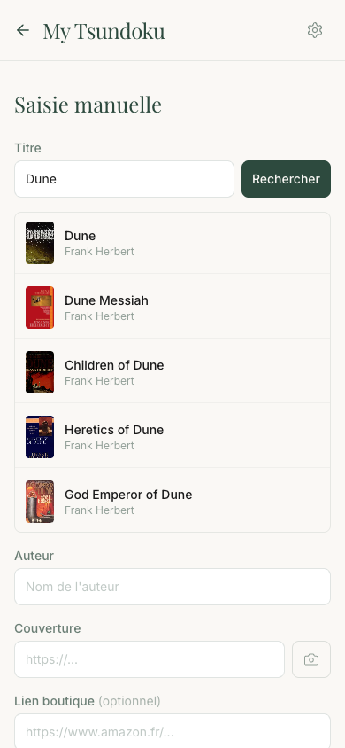
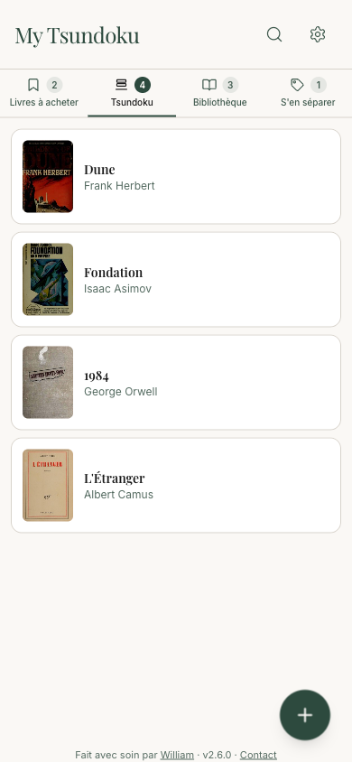

# Tsundoku

Tsundoku (積ん読) is a PWA for organizing personal book collections. Inspired by the Japanese concept of letting unread books pile up, it provides a Kanban-style board to track books across four stages: wishlist, unread pile, library, and to sell. Available in French and English, with light and dark mode. Works offline with local-first storage — optionally sign in to sync across devices and contribute to the community book catalog.




## Tech Stack

- **Next.js 16** (App Router, Turbopack) + **React 19** + **TypeScript**
- **Tailwind CSS v4** for styling
- **Dexie.js** for IndexedDB (local-first storage)
- **Supabase** for auth (email OTP code), cloud sync, storage, and community catalog
- **Serwist** for PWA / service worker (configurator mode)
- **@dnd-kit/core + @dnd-kit/sortable** for drag-and-drop
- **motion** for animations
- **@zxing/browser** for barcode scanning
- **react-image-crop** for cover photo cropping
- **Vitest** for testing

## Running Locally

```bash
cp .env.example .env.local   # fill in your Supabase credentials
npm install
npm run dev
```

Open [http://localhost:9876](http://localhost:9876).

### Environment Variables

| Variable | Description |
|---|---|
| `NEXT_PUBLIC_SUPABASE_URL` | Supabase project URL |
| `NEXT_PUBLIC_SUPABASE_ANON_KEY` | Supabase publishable (anon) key |

### Build

```bash
npm run build    # next build && serwist build
```

### Tests

```bash
npm test           # single run
npm run test:watch # watch mode
```

## Project Structure

```
src/
├── app/           # Next.js App Router pages
│   ├── page.tsx           # Home — Kanban board
│   ├── add/               # Add book (manual entry, barcode scan)
│   ├── book/[id]/         # Book detail & edit
│   ├── settings/          # Settings & backup
│   └── ~offline/          # Offline fallback page
├── components/    # Reusable UI components
├── hooks/         # Custom React hooks (useBooks, useBook, useBooksByStage, useIsMobile)
└── lib/           # Business logic, types, DB, constants
```

## Roadmap

Planned features (in no particular order):

- **Sort your piles** — Order a column by author, title or date added
- **Pile statistics** — See how fast your pile grows, and how long your books have been waiting
- **Find in a bookshop** — Reach the books you mean to buy at your bookshop, in one tap

Have a suggestion? [Get in touch](mailto:contact@my-tsundoku.app).

## Deployment

Auto-deployed on **Vercel** on push to `main`.

- **URL**: https://www.my-tsundoku.app

## License

This project is licensed under the [GNU Affero General Public License v3.0](LICENSE).

Commercial licensing available — contact [w@revah.paris](mailto:w@revah.paris).

## Author

Made with care by [William](https://william.revah.paris)
